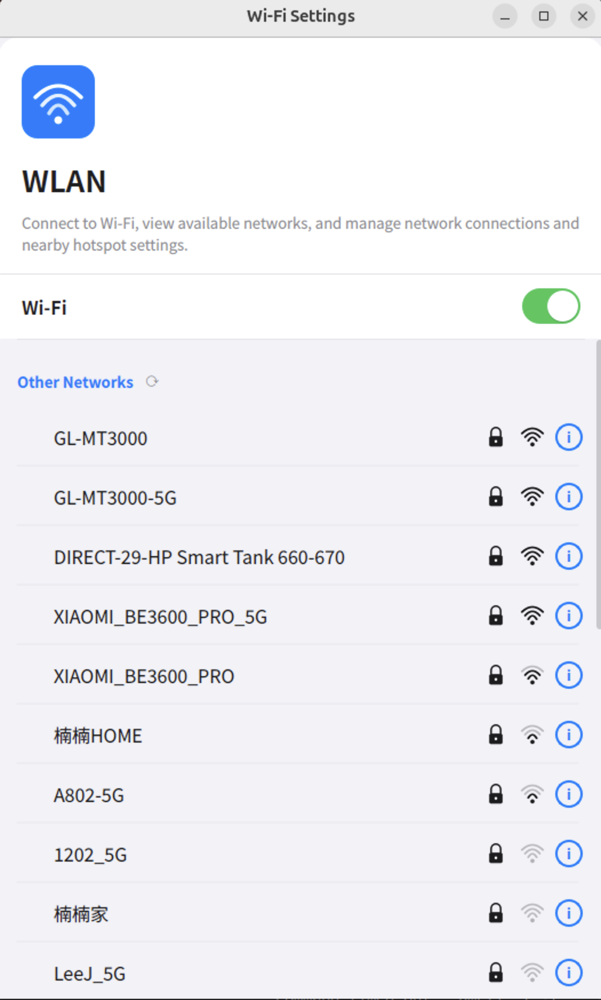

# WiFiSettings — 无线局域网设置

基于 Linux Qt5 构建的无线局域网设置应用程序，采用 iOS 风格的用户界面设计。



## 功能特性

- **iOS 风格界面** — 简洁现代的设计，包含开关控件、网络列表和圆角卡片
- **WiFi 扫描** — 通过 `iwlist` 发现可用网络，支持定时自动刷新（每 15 秒）
- **连接 / 断开** — 加密网络弹出密码输入框，开放网络直接连接
- **网络详情** — 查看网络详细信息（SSID、BSSID、信号强度、频率、信道、安全类型）；已连接网络额外显示 IP 配置（IP 地址、子网掩码、网关、DNS）
- **中英双语** — 支持英文（默认）和简体中文，根据系统语言自动检测
- **SVG 矢量图标** — WiFi 信号强度、锁、对勾、信息按钮等均采用 SVG 矢量图标
- **架构分层** — 业务逻辑（`src/core/`）与 UI 展示（`src/ui/`）严格隔离

## 项目架构

```
WiFiSettings/
├── main.cpp                        # 程序入口，翻译加载
├── WiFiSettings.pro                # qmake 项目文件
├── src/
│   ├── core/                       # 业务逻辑层（无 UI 依赖）
│   │   ├── WifiNetwork.h/cpp       # WiFi 网络数据模型
│   │   ├── WifiBackend.h/cpp       # 系统命令封装（iwlist, wpa_cli）
│   │   └── WifiManager.h/cpp       # 高层管理器，提供信号/槽接口
│   └── ui/                         # UI 展示层
│       ├── MainWindow.h/cpp        # 主窗口
│       ├── SwitchButton.h/cpp      # 自定义动画开关控件
│       ├── NetworkItemWidget.h/cpp  # 单个网络行组件
│       ├── NetworkListWidget.h/cpp  # 可滚动网络列表
│       ├── PasswordDialog.h/cpp    # 密码输入对话框
│       └── NetworkInfoDialog.h/cpp # 网络详情对话框
├── resources/
│   ├── resources.qrc               # Qt 资源文件
│   ├── icons/                      # SVG 图标
│   └── translations/               # 翻译文件
│       ├── wifi_en.ts / wifi_en.qm # 英文翻译
│       └── wifi_zh.ts / wifi_zh.qm # 中文翻译
└── build/                          # 编译输出目录
```

## 环境要求

### 系统依赖

```bash
# Ubuntu / Debian
sudo apt-get install -y \
    qtbase5-dev \
    qttools5-dev-tools \
    libqt5svg5-dev \
    wireless-tools \
    wpasupplicant
```

| 软件包 | 用途 |
|--------|------|
| `qtbase5-dev` | Qt5 核心、GUI、Widgets 开发库 |
| `qttools5-dev-tools` | `lrelease`、`lupdate` 翻译工具 |
| `libqt5svg5-dev` | Qt5 SVG 渲染支持 |
| `wireless-tools` | `iwlist` WiFi 扫描工具 |
| `wpasupplicant` | `wpa_cli` / `wpa_supplicant` 连接管理 |

### WiFi 后端工具

应用程序依赖以下系统命令（需在 `$PATH` 中可用）：

| 工具 | 用途 |
|------|------|
| `iwlist` | 扫描可用 WiFi 网络 |
| `wpa_cli` | 连接管理（连接、断开、状态查询） |
| `ip` | 网络接口启停、IP 地址查询 |
| `dhclient` | 连接后获取 DHCP 地址 |

## 编译

```bash
# 1. 编译翻译文件
QT_SELECT=qt5 lrelease resources/translations/wifi_en.ts resources/translations/wifi_zh.ts

# 2. 编译项目
mkdir -p build && cd build
qmake ../WiFiSettings.pro
make -j$(nproc)
```

## 运行

```bash
# 默认运行（根据系统语言自动选择，无匹配时使用英文）
./build/WiFiSettings

# 强制使用英文
./build/WiFiSettings --lang en

# 强制使用中文
./build/WiFiSettings --lang zh
```

> **注意：** WiFi 操作（扫描、连接、接口控制）通常需要 root 权限。
> 如需完整的 WiFi 功能，请使用 `sudo` 运行：
>
> ```bash
> sudo ./build/WiFiSettings
> ```

## 使用说明

### 开启 / 关闭 WiFi
点击顶部的绿色开关控件即可启用或禁用无线网络接口。

### 连接网络
点击网络列表中的网络名称：
- **加密网络** — 弹出密码输入对话框，输入密码（WPA 最少 8 位字符）后点击"连接"
- **开放网络** — 无需密码，直接连接
- **已连接网络** — 点击当前已连接的网络将提示是否断开连接

### 查看网络信息
点击任意网络行右侧的蓝色 **(i)** 按钮，可查看详细信息：
- **网络信息**：SSID、BSSID、安全类型、信号强度、频率、信道
- **IP 配置**（仅已连接网络）：IP 地址、子网掩码、网关、DNS

## 国际化（i18n）

所有用户可见的字符串均使用 `tr()` 包裹以支持翻译。

### 已支持的语言

| 语言 | 文件 | 状态 |
|------|------|------|
| English | `wifi_en.ts` | ✅ 已完成（默认） |
| 简体中文 | `wifi_zh.ts` | ✅ 已完成 |

### 添加新语言

1. 复制 `resources/translations/wifi_en.ts` 为 `wifi_XX.ts`
2. 翻译所有 `<translation>` 元素
3. 在 `WiFiSettings.pro` 的 `TRANSLATIONS` 中添加该 `.ts` 文件
4. 在 `resources/resources.qrc` 中添加对应的 `.qm` 条目
5. 在 `main.cpp` 中更新语言检测逻辑
6. 运行 `lrelease` 并重新编译

## 许可协议

本项目仅供学习和开发用途。
